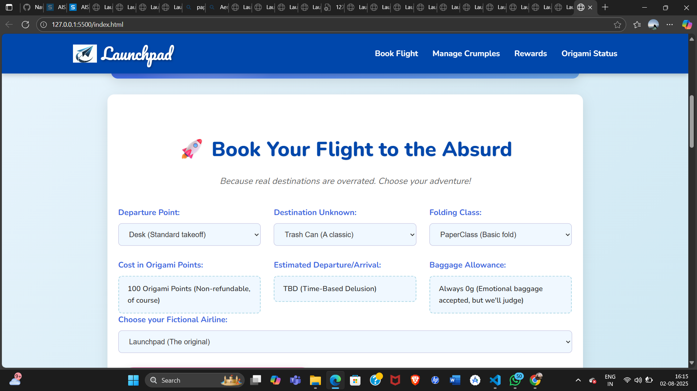
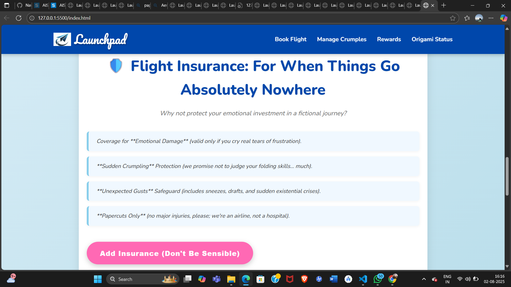

# Flightly 🎯

## Basic Details
### Team Name: Launchpad

### Team Members
- Member 1:[Janet Naveena] - [Aisat]
- Member 2:[Fathima Nourin P.S] - [Aisat]

### Project Description
[A revolutionary (and entirely impractical) web platform that lets users book seats on paper airplanes. Whether you're flying to FantasyLand or just across the desk, Flightly makes sure you're “booked” for takeoff]

### The Problem (that doesn't exist)
[People are struggling to book flights on real airplanes because they cost money and follow the laws of physics. What about the millions of tiny paper planes out there, sitting idle, unemployed, and emotionally unfulfilled?]

### The Solution (that nobody asked for)
[Introducing Flightly – a website where you can reserve a seat on your favorite paper plane model. Pick your aircraft (we have PaperIndia, RollAir, and even the TuckGo ), choose your imaginary destination, and take off into pure nonsense.]

## Technical Details
### Technologies/Components Used
For Software:
- [Language used:Html,Css,Javascript]
- [Tools used:VS code,Canva,Microsoft designer,Git,Github,Vercel(for flying deployment)]

For Hardware:
- [(None.This is a zero hardware,100% metaphorical flight experience)]

### Implementation
For Software:
# Installation
[git clone https://github.com/yourusername/flightly  
cd flightly  
open index.html]

# Run
[Simply open index.html in a browser.
No server, no backend, no logic—just vibes]

### Project Documentation
For Software:

# Screenshots (Add at least 3)

*This screenshot is from a "Book Your Flight to the Absurd" page, where users can choose a "Departure Point" (Desk) and "Destination Unknown" (Trash Can). It details a "Cost in Origami Points" and "Estimated Departure/Arrival" as "TBD (Time-Based Delusion)," highlighting the entirely imaginative nature of the "flight." The page embraces the concept of "emotional baggage" and suggests the "Launchpad" as the "fictional airline."*

*This screenshot shows a page titled "Your Absolutely Real (Not) Boarding Pass," underscoring that the entire experience is purely conceptual. It serves as "proof that you're going somewhere... in your mind." The main interaction offered is a button to "Generate My Absurd Boarding Pass," maintaining the humorous and imaginative tone of the application.*

*This screenshot displays a whimsical "Flight Insurance" page, humorously offering coverage for "emotional damage" and "sudden crumpling" of a paper plane. It playfully acknowledges the fictional nature of the journey by stating "we're an airline, not a hospital" for "Papercuts Only." The large pink button at the bottom says "Add Insurance (Don't Be Sensible)," reinforcing the lighthearted and absurd theme.*

# Diagrams

*Add caption explaining your workflow*

For Hardware:

# Schematic & Circuit

*Add caption explaining connections*

*Add caption explaining the schematic*

# Build Photos

*List out all components shown*

*Explain the build steps*

*Explain the final build*

### Project Demo
# Video
[https://drive.google.com/file/d/1U9DQrrheuluyt3ASV7XPl7Euvs_PLA_F/view?usp=drivesdk]
*The video showcases an imaginative web application called "Launchpad," which allows users to book a "flight to the absurd." It demonstrates the process of selecting whimsical flight details, such as a "Departure Point" like a "Desk (Standard takeoff)" or a "Chair (Slightly wobbly)," and a "Destination Unknown" like a "Trash Can (A classic)" or "Regret (Popular during exams)."

The user also chooses a "Folding Class," either "PaperClass (Basic fold)" or "CrumpleClass (Economy, pre-loved)." The flight "costs" 100 Origami Points, with an "Estimated Departure/Arrival" as "TBD (Time-Based Delusion)." The video then shows selecting a "fictional airline" from a list of humorous names like "AeroGum" or "JetMolam," and proceeding to "Book My Non-Existent Flight!"

After "booking," the application presents "Our Truly Unforgettable In-Flight Services," which include comical items like "Air Chips (Invisible Edition)" and "Crumpled Water™." The user then explores "Flight Insurance: For When Things Go Absolutely Nowhere," offering coverage for "Emotional Damage" and "Sudden Crumpling." Finally, the video concludes by generating a "Your Absolutely Real (Not) Boarding Pass," confirming the "flight" from "Desk" to "Trash Can" as purely imaginary.*

# Additional Demos
[Add any extra demo materials/links]

## Team Contributions
- [Janet Naveena]: [Concept design, UI layout, boarding pass generator,HTML/CSS implementation]
- [Fathima Nourin P.S]: [Visual design, form UX, absurd, copywriting html2canvas integration]

---
Made with ❤️ at TinkerHub Useless Projects 

